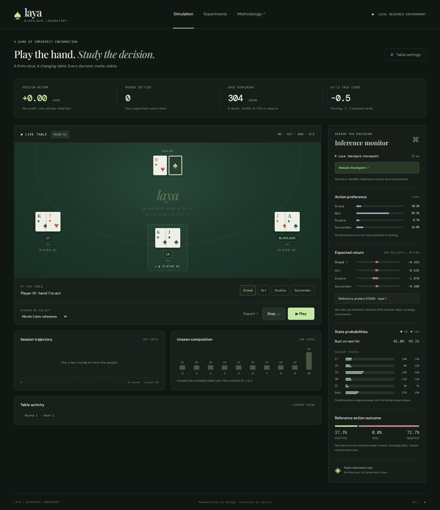
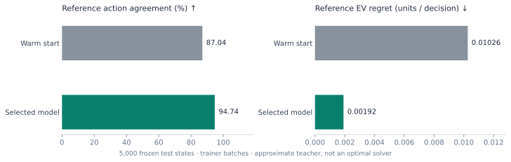
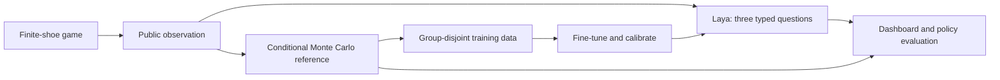
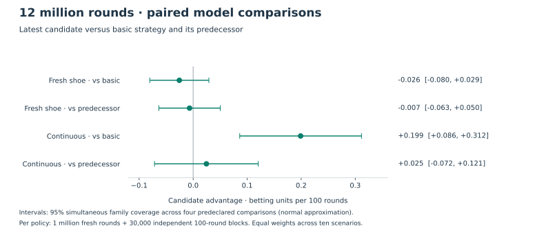

# Laya Blackjack Laboratory

**Watch a learned policy play. Inspect what it believes. Measure where it fails.**

A finite-shoe blackjack simulator, interactive research dashboard, and reproducible training pipeline built around [Laya](https://huggingface.co/convaiinnovations/laya). One learned player shares the table with up to six simulated players. Every decision uses the cards a player can observe.

[Model on Hugging Face](https://huggingface.co/adambloebaum/laya-blackjack) · [Measured results](docs/release-results.md) · [Usage](docs/usage.md) · [Model card](MODEL_CARD.md)



## What you can explore

- **Play and observe.** Step through a hand or autoplay; inspect splits, wagers, exposed cards, unseen rank counts, and the return trace. Export a deterministic replay.
- **Compare beliefs.** The sidebar separates learned action preferences, next-hit bust probability, and dealer finish predictions from the Monte Carlo reference and its uncertainty.
- **Change the game.** Configure 1–7 seats, 1/2/4/6/8 decks, S17/H17, 3:2 or 6:5 payout, surrender, double after split, shoe penetration, and tablemate behavior.
- **Run experiments.** Generate independent game splits with parallel CPU workers, fine-tune candidates on separate GPUs, calibrate probabilities, and evaluate paired returns on fresh and continuous shoes.

## Start locally

Requires [uv](https://docs.astral.sh/uv/). Python 3.13 is the tested environment; the package permits Python 3.11–3.13. CUDA speeds inference and training; the simulator runs on CPU.

```bash
git clone https://github.com/adambloebaum/laya-blackjack.git
cd laya-blackjack
uv sync --extra model --extra dev
uv run --no-sync blackjack fetch-model
uv run --no-sync blackjack serve
```

Open **http://127.0.0.1:8000** and click **Load trained Laya**. The approximately 1.7 GB model download uses an immutable Hugging Face revision and verifies every packaged file before installation. While this release is private, authenticate first with `uv run --no-sync hf auth login` using an account with repository access.

For the simulator alone, use `uv sync --extra dev` and skip the download. Model inference becomes available when dependencies and weights are installed. There is no paid inference API or frontend build step. The server is intended for localhost use and has no remote authentication.

## Measured model quality

The selected checkpoint was fine-tuned on **100,000 simulation states**, with separate **2,000 selection**, **2,000 calibration**, and **5,000 test** states. Two full-model candidates trained on two RTX 4090s; selection used reference EV regret on the selection split.

| Frozen test metric | Warm start | Selected model |
| --- | ---: | ---: |
| Reference action agreement | 87.04% | 94.74% |
| Reference EV regret, units / decision ↓ | 0.010262 | 0.001915 |
| Next-hit probability Brier distance ↓ | 0.011246 | 0.000821 |
| Dealer probability Brier distance ↓ | 0.002351 | 0.001650 |

These are the trainer's batched metrics. A separate audit through the serving SDK measured **94.72% agreement** (95% game-cluster bootstrap interval: **94.08–95.34%**) and **0.001926 units of reference regret**. Small numerical differences near tied actions can change an argmax. The audit and release preserve both measurements.



The reference uses Monte Carlo action values with a basic-strategy continuation. Matching it is an imitation result, not proof of optimal play or a casino advantage. See the [full evaluation](docs/release-results.md) for **600,000 simulated rounds**, paired return intervals, subgroup weaknesses, and fresh-world checks of the largest mistakes.

## How it works



The model sees the active hand, legal actions, exposed table, rules, and unseen rank counts. It never receives the seed, dealer hole card, or future shoe order. The reference samples concealed cards without replacement and conditions on a negative dealer peek.

Training is supervised distillation. Action preferences describe the model's distribution over legal decisions; they are **not win probabilities**. The next-hit target is an exact conditional rank calculation. Dealer finish predictions assume no additional player draws. Context overflow fails explicitly rather than dropping state silently.

The simulator uses American hole-card rules, fixed unit wagers, and no insurance or side bets. Doubles and splits count against the original wager; split aces get one card and do not resplit. A conservative reserve may trigger an early shuffle in small crowded shoes. Rare mid-round exhaustion voids the round. The [design](docs/design.md) and [usage guide](docs/usage.md) explain the full contract.

## Research and development

Start with the [training and evaluation commands](docs/usage.md), [overnight experiment guide](docs/scaling-experiment.md), and [next research questions](docs/roadmap.md). Machine-readable reports and plotting code accompany the release claims; historical pilot results remain [archived](docs/experiments.md).

The completed [composition-focused experiment](docs/targeted-experiment.md) improved reference agreement on fresh general/depleted games; its return comparison remains inconclusive. Its candidate is retained locally for further research. The protocol seals final-test predictions until both candidates are selected:

```bash
uv run --no-sync blackjack targeted --output artifacts/overnight/composition-run --source artifacts/checkpoints/released --hours 12 --workers 24
```

It uses both local GPUs and retains the released model while generating comparison evidence. Run unattended jobs under a process manager; the CLI stays attached to its terminal.

The completed [exact-reference and decision-cost follow-up](docs/teacher-cost-experiment.md) improved same-test reference agreement from 94.96% to 95.90%; the two objectives were almost tied on selection. The subsequent [12-million-round comparison](docs/large-return-results.md) measured a continuous-play advantage of **+0.199 betting units per 100 rounds over the basic heuristic** (adjusted interval +0.086 to +0.312). Differences from the predecessor and both fresh-shoe comparisons remain inconclusive. Average returns were still negative. The report includes all scenario contrasts, fresh-world error checks, and the decision to qualify model-visited data before further training.



Intermediate checkpoints stay private; the project will publish one final selected model. These research results describe the latest local candidate; the download above remains the existing packaged model until final selection.

The stronger-label [model-visited-data pilot](docs/model-visited-pilot.md) qualified fresh collection and labeling. The subsequent [matched training study](docs/model-visited-training.md#completed-results) completed two 32,000-state training arms, three SDK audits, and **800,000 return rounds**. Model-visited training won the frozen selection rule, but its final return differences from the incumbent remain inconclusive: −0.025 units per 100 fresh rounds and +0.297 per 100 continuous rounds, with adjusted intervals spanning zero. Reference regret was 2.11% lower by point estimate, also unresolved. The candidate remains private and inactive; the report preserves the batch-parity failure and exact-SDK evaluation recovery.

A fresh [SDK replication](docs/model-visited-training.md#independent-sdk-replication) is prepared with the same matched training schedule and a fixed **1.6-million-round** evaluation. It will test repeatability before final model selection; no improvement is assumed in advance.

```bash
uv run --no-sync pytest -q
uv run --no-sync ruff check blackjack tests scripts
npm ci
npx playwright install chromium
npm test
```

The application is plain HTML/CSS/JavaScript served by FastAPI. Node is only needed for browser tests. CI exercises the simulator, information boundaries, API, replay, artifact integrity, paired evaluation, and responsive interface without downloading model weights.

See [contributing](CONTRIBUTING.md), [security](SECURITY.md), and the [release process](docs/release.md). Code and released model modifications are licensed under **Apache 2.0**; [NOTICE](NOTICE) credits Laya and its ModernBERT backbone. This is an independent research project.
