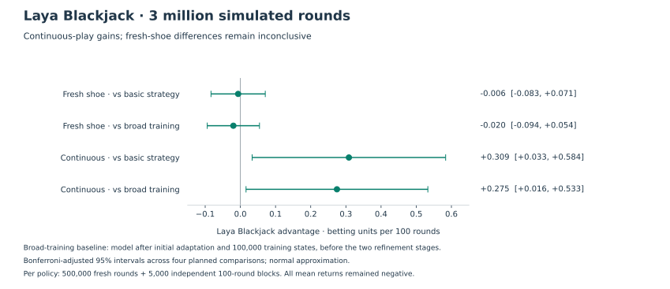
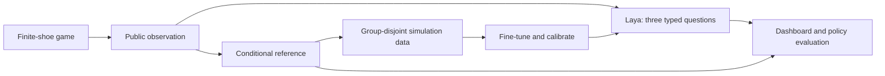

# Laya Blackjack Laboratory

**Watch a learned policy play. Inspect its predictions. Measure where it fails.**

A finite-shoe blackjack simulator, interactive dashboard, and reproducible research pipeline built around [Laya](https://huggingface.co/convaiinnovations/laya). One learned player shares the table with up to six simulated players. Every decision uses only information a player can observe.

[Selected model](https://huggingface.co/adambloebaum/laya-blackjack) · [Results](docs/release-results.md) · [Usage](docs/usage.md) · [Model card](MODEL_CARD.md)


## Explore the table

- **Watch decisions.** Step through hands or autoplay; inspect splits, wagers, exposed cards, unseen rank counts, and returns. Export a deterministic replay.
- **Compare predictions.** The sidebar separates learned action preferences, next-hit bust probability, and dealer finish predictions from the Monte Carlo reference and its uncertainty.
- **Change the rules.** Configure 1–7 seats, 1/2/4/6/8 decks, S17/H17, 3:2 or 6:5 payout, surrender, double after split, shoe penetration, and tablemate behavior.
- **Run research.** Generate independent game splits with parallel CPU workers, fine-tune candidates, calibrate probability outputs, and evaluate paired returns on fresh and continuous shoes.

## Start locally

Requires [uv](https://docs.astral.sh/uv/). Python 3.13 is the tested environment; the package supports Python 3.11–3.13. CUDA speeds model inference and training. The simulator itself runs on CPU.

```bash
git clone https://github.com/adambloebaum/laya-blackjack.git
cd laya-blackjack
uv sync --extra model --extra dev
uv run --no-sync blackjack fetch-model
uv run --no-sync blackjack serve
```

Open **http://127.0.0.1:8000** and click **Load trained Laya**. The project and selected model are public; no Hugging Face account is required. Weights occupy about 1.7 GB, with additional evaluation and training evidence. Downloads use an immutable Hugging Face revision and verify every packaged file before installation.

**Existing installation:** if the earlier model already occupies `artifacts/checkpoints/released`, download into a new directory with `uv run --no-sync blackjack fetch-model --output artifacts/checkpoints/released-v1`. The old checkpoint is preserved; the dashboard discovers the new completed installation when reloaded.

For the simulator alone, use `uv sync --extra dev` and skip authentication and model download. There is no paid inference API or frontend build step. The server is intended for localhost use and has no remote authentication.

## What the selected model achieves

Five frozen research candidates were compared on **8,192 new selection states**, followed by **16,384 untouched test states** and a fixed **3-million-round** policy benchmark. The teacher-cost study's ordinary-imitation model was retained. No training or calibration occurred during final selection.

| Same fresh test, serving SDK | Previously packaged v0.2 | Selected model |
| --- | ---: | ---: |
| Reference action agreement | 92.83% | **95.95%** |
| Reference EV regret, units / decision ↓ | 0.003204 | **0.001014** |
| Next-hit probability Brier distance ↓ | 0.001650 | **0.000271** |
| Dealer probability Brier distance ↓ | 0.002527 | **0.000879** |

These measure agreement with a hybrid exact/Monte Carlo reference, not the probability of winning. The test equally weights general and depleted-shoe states; it does not represent ordinary-play state frequencies.



Continuous play gained **0.309 betting units per 100 rounds over basic strategy** and **0.275 over packaged v0.2**, with positive intervals after adjustment for the four planned comparisons. Fresh-shoe differences remain inconclusive. Absolute average returns remained negative: **−0.494 units per 100 fresh rounds** and **−0.555 per 100 continuous rounds**. These results do not establish a profitable or globally optimal player.

The [results report](docs/release-results.md) includes the full intervals, test design, limitations, and reproducibility records. One selected model is published on Hugging Face; intermediate weights remain in local private backups.

## How it works



Laya sees the active hand, legal actions, exposed table, rules, and unseen rank counts. It never receives the seed, dealer hole card, or future shoe order. Unseen cards include the concealed dealer card; reference probabilities condition on the dealer's negative blackjack peek.

Training uses supervised distillation. Action probabilities express preferences among legal actions, **not win probabilities**. Next-hit bust has an exact conditional rank target. Dealer finish predictions assume no further player draws. Context overflow fails explicitly rather than silently discarding state.

The research reference uses exact finite-shoe public-belief calculations within a restricted single-player, unsplit scope; other states use Monte Carlo with basic continuation. The live dashboard shows its separately labeled Monte Carlo reference. The simulator uses American hole-card rules, fixed wagers, no insurance or side bets, and a conservative early-shuffle reserve. The [design](docs/design.md) and [usage guide](docs/usage.md) describe the full contract.

## Research record

The selected lineage is a 500-state full-model pilot, a 100,000-state broad adaptation, 65,536 composition-focused states, and 65,536 states with the hybrid reference. Separate game groups drive training, candidate selection, temperature calibration, and final evaluation. The [model card](MODEL_CARD.md) records the exact lineage and settings.

| Study | Main finding |
| --- | --- |
| [Broad adaptation](docs/release-results-v0.2.md) | Improved over the pilot; no resolved advantage over basic strategy. |
| [Composition focus](docs/targeted-experiment.md) | Improved reference imitation; return differences unresolved. |
| [Hybrid reference and loss comparison](docs/teacher-cost-experiment.md) | Ordinary imitation narrowly won selection; became the retained research leader. |
| [12-million-round evaluation](docs/large-return-results.md) | Continuous advantage over basic strategy; predecessor comparison unresolved. |
| [Model-visited training and replication](docs/model-visited-training.md) | Did not establish an improved policy; original failures and negative findings preserved. |
| [Final selection and evaluation](docs/final-release-selection.md) | Retained the research leader; fresh final evidence supports both continuous-play comparisons. |

Reports, raw evaluation records, training data, source snapshots, and standalone figures accompany the selected model. Historical experiment weights remain private. Inspected test sets are never reused as untouched evidence for later tuning. See the [research roadmap](docs/roadmap.md) for limitations and possible future work.

## Development

```bash
uv run --no-sync pytest -q
uv run --no-sync ruff check blackjack tests scripts
npm ci
npx playwright install chromium
npm test
```

The application is plain HTML/CSS/JavaScript served by FastAPI. Node is used only for browser tests. CI checks simulation rules, hidden-information boundaries, API behavior, replay, artifact integrity, paired evaluation, and the responsive interface without downloading model weights.

Regenerate the release figures with `uv run --extra analysis python scripts/plot_final_release.py`. See [contributing](CONTRIBUTING.md), [security](SECURITY.md), and the [release process](docs/release.md). Code and model modifications use **Apache 2.0**; [NOTICE](NOTICE) credits Laya and ModernBERT. This is an independent research project.
