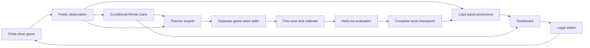

# Design and scope

The simulator owns privileged state. Its observation method emits the exposed table and aggregate public card memory. Both Laya and the reference consume that same observation. A separate replay export includes the initial seed and actions for reproducibility.

The research objective is expected net return per initial bet. Maximizing the chance of winning is a different objective, especially for doubles, splits, and surrender. Policy output probabilities describe a preference over legal actions; outcome distributions are shown separately.

The first release supports one focal player and up to six tablemates. Every seat is tracked and all cards are consumed from the same finite shoe. Tablemate behavior is a nuisance variable in data generation. There is no table coordination, privileged-state agent, bet sizing, insurance, or exact dynamic-programming solver.

The reference performs one-step policy improvement using conditional hidden-world rollouts. It compares legal first actions and follows basic strategy thereafter. Changing the rollout budget trades speed for Monte Carlo precision; it does not remove continuation-policy bias. A future stronger teacher could use exact finite-shoe recursion for tractable states, deeper policy iteration, or a carefully validated specialized solver.

Training distills three targets: reference action, next-hit bust probability, and dealer finish probabilities. Soft cross-entropy is used where a distribution target exists. This version does not implement upstream RLCD or online self-play reward updates. A deterministic, auditable baseline comes first; reinforcement learning should only be added with held-out return and calibration comparisons.

The web app is intentionally one Python service with static assets. GPU dependencies are optional. It remains useful when the model is unloaded and visibly indicates missing inference. Version checks reject duplicate or stale actions. Synchronous FastAPI handlers keep blocking computation outside the event loop.

No external messages, public deployments, remote training jobs, or hosted model uploads are part of this project.
