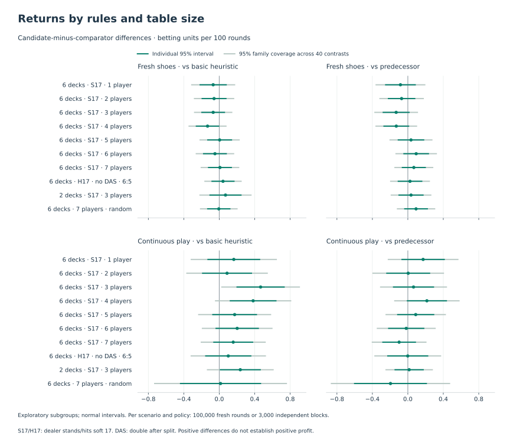

# Twelve-million-round evaluation

The model trained with stronger reference targets outperformed the basic-strategy heuristic during continuous play. Its comparison with the model before that training stage did **not** establish an incremental return gain. These same weights were later chosen for Laya Blackjack; this report describes an earlier evaluation, separate from the [final benchmark](release-results.md).

The [frozen protocol](large-return-evaluation.md) completed all 12 million rounds in 7 hours 18 minutes. Each policy played one million independent fresh rounds and 30,000 independent blocks of 100 continuous rounds. Ten rule/table scenarios have equal weight. There were no void rounds. Subsequent analysis reverified the raw records and reproduced the saved comparisons.


## What the return comparison establishes

All differences below are candidate-minus-comparator, in original betting units per 100 rounds. Intervals have 95% simultaneous coverage across the four predeclared comparisons, under the normal approximation. Continuous uncertainty uses independent blocks, not individual correlated rounds.

| Mode | Comparator | Difference | Adjusted interval |
| --- | --- | ---: | ---: |
| Fresh shoes | Basic heuristic | -0.0256 | -0.0802 to +0.0291 |
| Fresh shoes | Predecessor | -0.0067 | -0.0635 to +0.0502 |
| Continuous play | Basic heuristic | +0.1989 | +0.0862 to +0.3116 |
| Continuous play | Predecessor | +0.0245 | -0.0715 to +0.1206 |

Continuous-play average returns were **-0.2889 units per 100 rounds** for the candidate, -0.3134 for the predecessor, and -0.4878 for basic strategy. The candidate lost less than the basic heuristic within these simulator conditions; this does not establish a profitable playing policy. Wagers are fixed; no insurance or bet-sizing strategy is evaluated. The basic comparator is the repository's multi-deck heuristic, not a certified optimal strategy for every rule set.

## Rules and table sizes



All ten continuous-play candidate-minus-basic point estimates are positive. The two largest are six-deck S17 at three players (+0.4667 units per 100 rounds) and four players (+0.3822). Together they account for 42.68% of the aggregate point estimate because each scenario has a fixed one-tenth weight. This is an arithmetic decomposition, not proof that those table sizes cause a larger benefit.

| Continuous-play scenario | Candidate minus basic | Candidate minus predecessor |
| --- | ---: | ---: |
| Six decks, S17, one player | +0.1642 | +0.1723 |
| Six decks, S17, two players | +0.0880 | +0.0040 |
| Six decks, S17, three players | +0.4667 | +0.0640 |
| Six decks, S17, four players | +0.3822 | +0.2148 |
| Six decks, S17, five players | +0.1737 | +0.0887 |
| Six decks, S17, six players | +0.2025 | -0.0182 |
| Six decks, S17, seven players | +0.1578 | -0.0983 |
| Six decks, H17, no DAS, 6:5, three players | +0.1019 | -0.0012 |
| Two decks, S17, three players | +0.2375 | +0.0148 |
| Six decks, seven players, random tablemates | +0.0145 | -0.1958 |

The subgroup analysis is exploratory. Its separate Bonferroni family includes all **40** scenario/mode/comparator contrasts. Only the continuous three-player candidate-minus-basic interval excludes zero after that adjustment (+0.0292 to +0.9042). No scenario establishes a candidate-minus-predecessor difference. The apparent fresh-shoe loss at four players also becomes inconclusive after adjustment. We will not train exclusively for the best-looking subgroup or treat the weakest point estimate as an established regression.

The raw return records contain settled profits and decision counts, not complete decision traces. They cannot identify which particular actions or shoe compositions caused the gain. A composition-aware explanation is a hypothesis that requires a separate ablation or trace study. The error audit below concerns a different, enriched state population and must not be presented as a causal decomposition of these returns.

## Where decision errors remain

The existing 8,192-state serving audit has 4,096 general and 4,096 depleted states. Both models were evaluated on exactly the same public states and reference targets. The latest candidate made 336 reference disagreements versus 413 for its predecessor, with 35.54% lower total reference regret.

| Remaining candidate errors | Observation |
| --- | --- |
| Depleted-state cost | 69.76% of measured reference regret; this is the deliberately enriched half of the test |
| Hit-versus-stand confusions | 52.82% of measured reference regret |
| Thirty largest errors | 32.50% of measured reference regret |
| Unresolved reference labels | 256 of 336 disagreements (76.19%) and 56.33% of measured regret |
| Resolved reference labels | 80 disagreements and 43.67% of measured regret |

These are descriptive, reference-dependent costs. A sampling separation heuristic does not prove a label correct, and fewer disagreements alone need not mean less economic error. This audit has been inspected; it cannot be reused as the locked final test after further tuning.

## Fresh-world label check

We rechecked the **25 Monte Carlo cases among the thirty largest recorded errors**, using 20,000 fresh hidden worlds per case (four fixed 5,000-world replicates, 500,000 worlds total). Each world compares the original reference action with the original model action, followed by the same basic continuation policy. Actions were fixed before these samples and were not reselected. The five exact-reference cases were excluded: a basic-continuation Monte Carlo calculation would evaluate a different target from their optimal-continuation reference.

- Twenty-one cases favor the original reference action using nominal 95% intervals.
- **Twenty cases still favor it after correction across all 25 rechecks.**
- Five adjusted intervals include zero; none establishes that the model action is better.

This supports a focused follow-up: many costly mistakes persist under fresh sampling. It does not show that the teacher is optimal, remove continuation-policy bias, estimate ordinary-play error prevalence, or prove that a particular training change will improve returns. The cases were selected for large recorded errors, so their original regret magnitudes are selection-biased.

## Follow-up motivated by these results

**These results motivated a test of training on states visited by the learned policy.** Do not simply extend the prior training schedule or repeat the decision-cost objective sweep: the loss arms were nearly tied on selection, and the new return comparison does not resolve the latest stage's incremental benefit.

The follow-up plan was to:

1. Freeze the current candidate and collect new public-state trajectories across all ten scenarios, retaining complete game identities and recording depletion, legal actions, and teacher coverage. Keep execution-smoke games separate. First qualify the collector and label stability on a small pilot; do not train directly on these inspected test errors.
2. Mix model-visited states with broad coverage. Compare that mixture against equally sized broad-data training, using the same checkpoint, labeling method, optimizer settings, number of updates, and compute budget. Concentrate extra *labeling* effort on costly ambiguous decisions without silently removing general states.
3. Use the exact public-belief reference only where it supports the state. Preserve explicit Monte Carlo fallback labels elsewhere; verify continuation semantics before interpreting rechecks. A stronger split/multiplayer solver is separate work and should not be confounded with the data-mixture comparison.
4. Keep the unchanged incumbent eligible. Use new, group-disjoint selection, calibration, and locked final-test games, with guards for general states, fresh shoes, and probability quality. Freeze sample counts, seeds, stopping rules, and practical improvement criteria before training; only the eventual selected candidate reaches a new final return evaluation.

The resulting [model-visited training study and replication](model-visited-training.md) did not establish a better policy. The model evaluated here was subsequently chosen for Laya Blackjack and tested in the separate [final benchmark](release-results.md).

## Evidence and reproduction

[Verified analysis JSON](results/large-return-analysis.json) includes both original return reports, the four-comparison summary, all scenario contrasts, audit aggregates, case-level recheck results, and source hashes. [CSV](results/large-return-analysis.csv) provides exact scenario estimates and both interval types. Raw return shards, public error states, and frozen model snapshots remain in private local artifacts.

Rebuild the publication figures from committed summaries without loading a model:

```bash
uv run --extra analysis python scripts/plot_large_returns.py
```

Reverify raw data and rebuild the analysis on the experiment workstation:

```bash
uv run --no-sync python scripts/analyze_large_returns.py --run artifacts/evaluations/20260922-051218-returns-12m --audit artifacts/overnight/20260921-173017-teacher-cost/audit --recheck artifacts/analysis/20260922-returns-followup --output docs/results/large-return-analysis.json
```

The recheck plan records the exact selected case indices and sampling configuration. To reproduce its simulations, select the Monte Carlo entries from the original `worst-states.json` in their original order, place that subset at the plan's `mc-errors/worst-states.json`, then run:

```bash
uv run --no-sync blackjack recheck-errors --audit artifacts/analysis/20260922-returns-followup/mc-errors --output artifacts/analysis/20260922-returns-followup/mc-recheck.json --workers 24 --samples 5000 --repeats 4
```

Use the recheck plan's source revision for exact reproduction. The original command's generic scope text assumes thirty cases; the verified analysis above records the actual twenty-five-case subset and exclusion of exact targets. Rebuilding summaries or figures does not change any checkpoint, selection, or release visibility.
