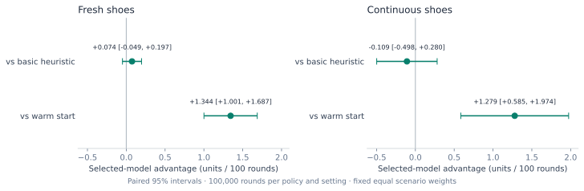
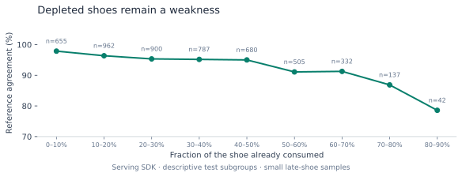

# Broad-training experiment

This study evaluates the 100,000-state broad-training stage against the initial 500-state adaptation and a basic-strategy heuristic. Its checkpoint is the broad-training baseline in the [final performance report](release-results.md). The measurements below come from this stage’s own evaluation, not the final model’s test.

Measured locally on 2026-09-20/21. The larger fine-tune improves reference imitation and realized returns over the earlier warm-start model. It does **not** establish an advantage over the basic-strategy heuristic or positive expected profit.

## Training and selection

The overnight run generated all 109,000 requested states and completed two full-model candidates in 5 hours 47 minutes using 24 CPU workers and two RTX 4090s. Whole-game seeds are disjoint across 100,000 training, 2,000 selection, 2,000 calibration, and 5,000 final-test states. The 5e-6 learning-rate candidate, epoch 3, had the lowest selection EV regret (0.001353 versus 0.001620 for the other candidate). Selection was frozen before the following audit and return evaluation.

The [training report](results/overnight-100k.json), [candidate comparison](results/candidate-selection.json), and [generation plan](results/dataset-plan.json) preserve parameters, hashes, selection measurements, and final-test results. Both candidates share a seed; this is not a multi-seed training stability study.

## Serving audit

The deployed SDK measured 94.72% teacher agreement and 0.001926 units of reference EV regret on all 5,000 frozen states from 1,479 game groups. Two thousand whole-game bootstrap replicates give 95% intervals of 94.08–95.34% and 0.001589–0.002261, respectively. These intervals do not account for the Monte Carlo teacher’s estimation error. Median three-question SDK inference was 19.0 ms on an RTX 4090.

Trainer batches measured 94.74% agreement and 0.001915 regret. Different batch shapes can alter numerically close decisions. The action-only evaluator uses the serving call when the top two raw logits differ by less than 0.15; its actions matched the SDK on all 5,000 audited states with 32 fallbacks. The report preserves both serving and trainer metrics. This finite parity check does not prove identical decisions for every possible state. [Full audit](results/sdk-audit.json).

## Realized returns

Three fixed policies each played 100,000 fresh-shoe rounds and 100,000 continuous-shoe rounds: **600,000 rounds total**. Fresh mode uses 100,000 independent rounds per policy. Continuous mode uses 1,000 independent blocks of 100 rounds, including within-block shoe changes. The suite finished in 23.5 minutes. No rounds were voided.

Ten fixed scenarios receive equal weights: six-deck S17 tables with each size from one to seven players, an H17/no-DAS/6:5 table, a two-deck S17 table, and a seven-player table with random tablemates. Other rules use the defaults saved in each report. Initial seeds are paired by scenario and independent unit, but different actions can consume different cards and diverge thereafter.

Net return includes doubles and splits per original unit wager. The following numbers are **units per 100 rounds**, with 95% normal intervals. Continuous intervals use independent block averages, not individual correlated hands. Scenario-specific intervals in the JSON reports are exploratory and unadjusted for multiple comparisons.

| Setting | Policy | Mean return | 95% interval |
| --- | --- | ---: | --- |
| Fresh | Basic heuristic | -0.778 | [-1.482, -0.075] |
| Fresh | Warm start | -2.048 | [-2.750, -1.346] |
| Fresh | Selected Laya | -0.704 | [-1.410, +0.001] |
| Continuous | Basic heuristic | -0.131 | [-0.835, +0.573] |
| Continuous | Warm start | -1.519 | [-2.196, -0.843] |
| Continuous | Selected Laya | -0.240 | [-0.947, +0.467] |

The paired differences below directly measure the policy comparison; overlapping or non-overlapping individual-policy intervals are not used to infer a difference.

| Setting | Selected model compared with | Paired difference | 95% interval |
| --- | --- | ---: | --- |
| Fresh | Warm start | +1.344 | [+1.001, +1.687] |
| Fresh | Basic heuristic | +0.074 | [-0.049, +0.197] |
| Continuous | Warm start | +1.279 | [+0.585, +1.974] |
| Continuous | Basic heuristic | -0.109 | [-0.498, +0.280] |

The model improves on its warm start in both settings. Both comparisons with basic strategy include zero. Its own return intervals also include zero, with negative point estimates. These experiments do not demonstrate a profitable player. The basic comparator itself is a multi-deck heuristic; a stronger rule-exact baseline remains useful.

[Fresh report](results/fresh-comparison.json) · [Continuous report](results/continuous-comparison.json). Raw independent-unit records, configuration, and hash receipts are included with the model under `evaluation/paired-return-records.zip`.

## Where the model still fails

Mistakes become more common in depleted shoes. The late-shoe bins are small and have different mixes of rules and hands, so this descriptive trend is not an isolated causal effect of depth. The single-deck subset also has lower agreement (91.99%) than the overall sample.

The 30 largest recorded reference-regret mistakes were rechecked with 40,000 fresh public-information worlds each, in four independent 10,000-world batches. We compared the original fixed reference action against the fixed model action using the same sampled worlds and basic continuation. We did not reselect actions on these samples.

Twenty-eight of thirty individual 95% intervals favored the reference action. Examples include hard 9 versus dealer 3 in a depleted eight-deck H17 shoe at a strongly negative count: the model doubled, while hitting had a rechecked 0.205-unit advantage (95% interval 0.192–0.217). Hard 14 versus dealer 3 in a depleted six-deck S17 shoe chose stand; hit had a 0.172-unit advantage (0.159–0.185).

These deliberately selected cases are exploratory, with no multiplicity correction. They do not estimate the prevalence of costly errors. [Every rechecked case](results/error-recheck.json) is retained. This test set has now been inspected; future training guided by these findings needs a new locked final test.

The private Hub revision was downloaded and verified independently after upload. All 23 inventory files matched; 130 sampled and largest-error states reproduced their saved SDK actions with legal, normalized probabilities. [Download/reload receipt](results/hub-reload.json).

## Reproduce and extend

- Training code: Git commit `da4ef6f5c1b786dbc98b1cbbbb779462c76bd431`; the 500-state warm-start dataset was generated at `dcfaac4` and is included unchanged in the model package.
- The model’s `evaluation/` folder contains `synthetic-training-data.zip`, `pilot-data.zip`, `evaluation-source.zip`, `paired-return-records.zip`, `provenance.json`, and these measured reports. Archives preserve relative paths and individual dataset/return manifests.
- Extract the training archive into a new dataset directory. The `train-large` command verifies its saved manifest; regenerating the historical data requires the recorded training code revision. Use the saved pilot data to reproduce the six-epoch full-model warm start before the larger training run. Stochastic training and different hardware can still produce numerically different weights.
- The evaluator archive preserves the exact Python source used for the return run, including the original pre-release model loader. `provenance.json` records its source hashes. Release code adds package-integrity checks and rejects comparisons across different evaluator code without changing the model state/questions. Both published comparisons were recomputed exactly from the saved raw shards.
- Follow the [usage commands](usage.md) for a fresh evaluation. The model Hub commit and package manifest digest are pinned in `blackjack/model_release.json`.
- Rebuild figures from the committed JSON with `uv run --extra analysis python scripts/plot_results.py`.

The next experiment should target composition-sensitive decisions in depleted shoes, strengthen the reference where exact calculation is feasible, and compare with a compact structured-state model. More copies of the same average training distribution alone may not fix the largest errors. See the [roadmap](roadmap.md).
