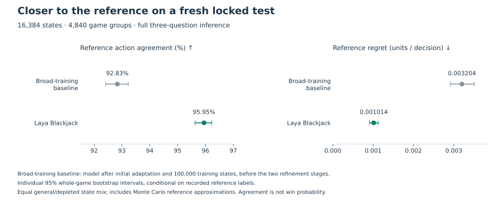

# Laya Blackjack: training and performance

Laya Blackjack matches **95.95%** of reference actions on its final decision test and improves continuous-play returns over a basic-strategy heuristic in a three-million-round benchmark. Fresh-shoe differences are inconclusive, and average returns remain negative.

[Model card](../MODEL_CARD.md) · [Selection protocol](final-release-selection.md) · [Verified measurements](results/final-release-completed.json)

## Training and comparison policies

The model was fine-tuned through a 500-state initial adaptation, 100,000 broad simulation states, 65,536 states emphasizing shoe composition, and 65,536 states labeled with a stronger reference. The last stage used ordinary imitation: learning the reference's action preferences and probability targets. Alternative cost-sensitive training and additional training on model-visited states did not establish a better policy. The [model card](../MODEL_CARD.md) records the data splits and optimizer settings.

This report compares three policies:

- **Laya Blackjack:** the published model after all four training stages.
- **Broad-training baseline:** the same model after the initial adaptation and 100,000-state broad-training stage, before shoe-composition training and stronger reference targets. This measures progress from the later stages together, rather than isolating the effect of one change.
- **Basic-strategy heuristic:** the simulator's transparent rule-based multi-deck policy. It is not an exact optimal strategy for every supported rule configuration.

Five completed training candidates were compared on 8,192 separate selection states. The rule was fixed before evaluation: alternatives had to improve reference regret with a multiple-comparison-adjusted bound and satisfy general/depleted-state guards. The ordinary-imitation model from the stronger-reference stage was retained. Its weights, tokenizer and calibration were frozen before any final test predictions or return measurements; neither training nor probability calibration used the final test.

## Decision quality

Laya Blackjack and the broad-training baseline predicted the same **16,384 states from 4,840 whole-game groups**, equally divided between general and depleted-shoe strata. This deliberately enriched distribution differs from ordinary-play visitation. The exact reference is restricted to supported single-player unsplit states within a 50,000-node limit. Remaining states use 4,096–16,384 sampled worlds with basic continuation.

| Same final SDK test | Broad-training baseline | Laya Blackjack |
| --- | ---: | ---: |
| Reference action agreement | 92.8345% | 95.9473% |
| Reference EV regret, units / decision | 0.00320423 | 0.00101425 |
| Next-hit Brier distance | 0.00164981 | 0.00027077 |
| Dealer Brier distance | 0.00252707 | 0.00087878 |
| Action preference Brier distance | 0.10846779 | 0.06084717 |

Laya Blackjack’s individual 95% whole-game bootstrap intervals are **95.6276–96.2274%** for agreement and **0.00091122–0.00112688** for regret, using 2,000 replicates. These condition on recorded reference labels and exclude Monte Carlo label uncertainty. Reference regret is the estimated value lost by choosing an action rather than the reference’s preferred action. It is 68.35% lower than the broad-training baseline by point estimate; this is not a 68% increase in profit or win rate. Brier distances measure squared differences from reference probabilities, with lower values indicating closer predictions.

Median measured SDK latency was **19.26 ms** on an RTX 4090, excluding loading. Every final Laya decision used all three serving questions. The accelerated action-only path was not evaluated here and has no release-wide parity guarantee.

## Realized returns

The three policies each played 500,000 independent fresh rounds and 5,000 independent continuous blocks of 100 rounds: **3,000,000 policy-rounds** in total. The independent units are rounds or blocks, not correlated individual hands. All ten fixed scenarios receive equal weights. They cover six-deck S17 at 1–7 seats, an H17/no-DAS/6:5 table, two-deck S17, and random tablemates at seven seats. Initial seeds are paired across policies, but different actions can consume different cards and diverge. No rounds were voided.

Fresh-shoe rounds start with a newly shuffled shoe. Continuous blocks preserve the remaining cards between rounds until a shuffle, so the policy can respond to changes in shoe composition.

All values are **betting units per 100 original-wager rounds**, including doubles and splits. The four aggregate contrasts were fixed before the run; intervals below apply a Bonferroni adjustment across that family with a normal approximation.

| Mode | Laya Blackjack minus | Difference | Familywise 95% interval |
| --- | --- | ---: | --- |
| Fresh | Basic heuristic | −0.00630 | [−0.08343, +0.07083] |
| Fresh | Broad-training baseline | −0.01990 | [−0.09414, +0.05434] |
| Continuous | Basic heuristic | +0.30854 | [+0.03349, +0.58359] |
| Continuous | Broad-training baseline | +0.27458 | [+0.01612, +0.53304] |

Both continuous comparisons support an advantage under the stated design. Fresh-shoe differences remain unresolved. Scenario intervals in the underlying reports are exploratory; the aggregate result does not establish an advantage for every table configuration.

| Absolute mean return | Basic | Broad-training baseline | Laya Blackjack |
| --- | ---: | ---: | ---: |
| Fresh | −0.48738 | −0.47378 | −0.49368 |
| Continuous | −0.86396 | −0.83000 | −0.55542 |

All mean returns are negative. The basic comparator is a transparent multi-deck heuristic, not exact optimal play under every rule set. Fixed-wager simulation evidence does not establish live-casino profitability, card-counting bet performance, or optimal multiplayer control.

## Reproducibility

The final run completed September 24, 2026 at 05:25 Pacific in **8 hours 44 minutes**, under its original 12-hour budget, using both local RTX 4090s and 24 CPU workers. Source revision: `16a356f68a633c6a455309a4bab867dbf4081d8e`. Every one of **7,380 return shards** and **1,515,000 policy-unit records** was hash-verified. The frozen selection decision, both paired return reports, and four-comparison summary reproduced from preserved inputs.

The model's `evaluation/` folder contains original data/audit/return records, the archived evaluator source, generation plans, selection evidence, training-lineage datasets and source snapshots, portable summaries, and standalone SVG/PNG figures. `evaluation/README.md` describes extraction and recomputation. Training-stage metrics and the new release comparison occupy separate blocks in `training_report.json`; their baselines and sample counts are never mixed.

Training datasets, settings and source snapshots document the full procedure from the upstream checkpoint. Intermediate model weights and optimizer recovery states are not distributed. Reproduction does not promise bit-identical optimization on different hardware.

The [model download pin](../blackjack/model_release.json) fixes both a Hub commit and the package manifest digest. The downloader verifies all packaged files before installation. The [release guide](release.md) links the download and inference checks. Rebuild these figures with `uv run --extra analysis python scripts/plot_final_release.py`.

The final test has been inspected. Any further tuning needs new locked evaluation games; these results cannot be reused as untouched evidence for a later model.
